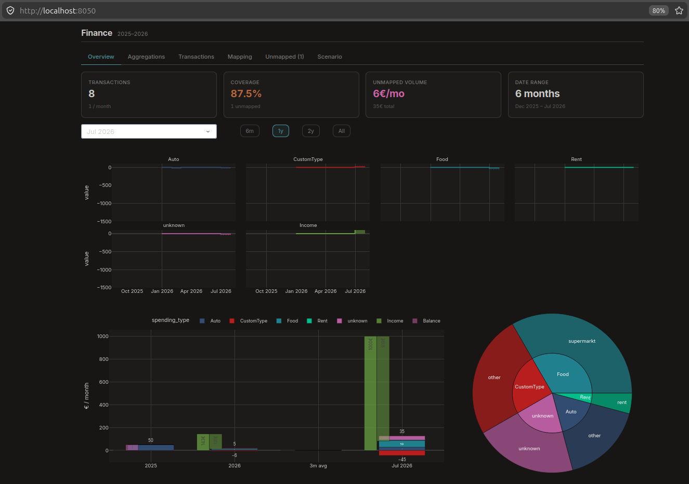

# bnkn

Personal finance dashboard for bank CSV exports of DKB accounts, with a reusable deduplicated ledger and rule-based transaction mapping.



## Setup

Requirements:
- Python 3.12+
- [uv](https://docs.astral.sh/uv/)

Install dependencies:

```bash
uv sync
```

Run the app:

```bash
uv run python -m finance_dashboard.app
```

## Folder structure

```text
bnkn/
├── data/                    # local only, not committed
│   ├── raw_bank_exports/    # original bank CSV exports
│   ├── working_ledger/      # optional saved ledger snapshots (ledger_*.csv)
│   └── mapping.csv          # local only, not committed
├── finance_dashboard/       # app source
└── pyproject.toml
```

## Data flow

- Place bank CSV exports in `data/raw_bank_exports/`.
- Optional: place an existing `ledger_*.csv` in `data/working_ledger/` to reuse prior categorizations.
- On startup, the app:
  - loads the latest ledger from `data/working_ledger/` if present,
  - loads all raw exports from `data/raw_bank_exports/`,
  - merges and dedupes transactions by date, amount, recipient, and purpose,
  - categorizes only unknown rows via `data/mapping.csv`.
- Use the **Save Working Ledger** button in the Transactions tab to save a new working ledger snapshot into `data/working_ledger/` and download it.

## Ledger concept

The ledger is the app’s working dataset:
- deduplicated across repeated exports,
- enriched with `spending_type` and `subtype`,
- reusable between runs so existing categorizations are preserved.

This means new raw exports only need incremental categorization work.

## Mapping rules

`mapping.csv` is a local-only ruleset for categorizing transactions.

Expected columns:

| column | meaning |
|---|---|
| `row` | which source field to search in |
| `keyword` | substring match to look for |
| `spending_type` | top-level category |
| `subtype` | finer-grained category |

Supported `row` values correspond to transaction fields such as:
- `Auftraggeber`
- `Verwendungszweck`
- `Kontonummer`
- `Zahlungspflichtige*r`

Matching logic:
- rules are evaluated by source field priority (follows the mapping table order),
- matching is substring-based, case-sensitive and non-regex (deliberately so that cases like **Aldi** and **Vivaldi** can be separated),
- transactions already categorized in the ledger are skipped,
- subtypes are optional and will be grouped as `other` und the corrspeonding category
- unmatched rows remain `unknown`.

## Notes

- `mapping.csv` should stay local and should not be committed.
- The dashboard is designed for personal workflows first, but the structure is reusable for colleagues with the same export format.